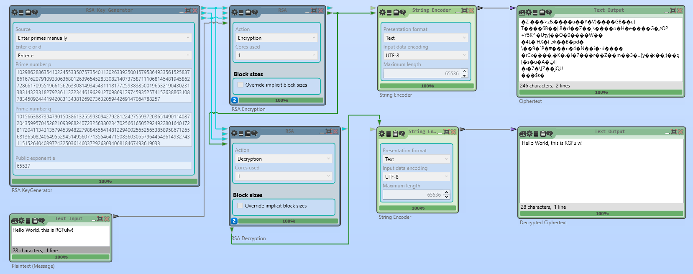
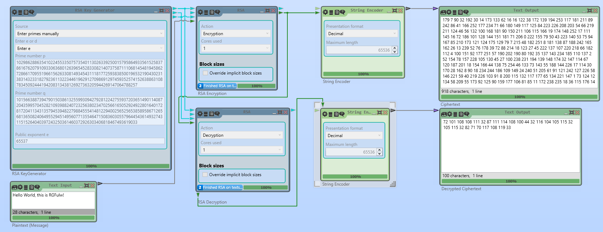

<h1>RSA Cryptanalysis</h1>

[RSA-2048](https://en.wikipedia.org/wiki/RSA_numbers#RSA-2048) is built upon two 1024-bit (256 byte) [pseudorandomly](https://en.wikipedia.org/wiki/Pseudorandom_number_generator) generated [Base-10](https://en.wikipedia.org/wiki/Decimal) prime numbers. Randomness and length of these prime numbers are the foundation of modern cryptography mechanisms withstanding decades of the most advanced cryptographers and mathematicians attempting to optimise and simplify the decryption process of this algorithm since first wide-spread use in the 1970s.

<h3>Q&A</h3>

This document outlines a number of flaws within the Rivest-Shamir-Adleman algorithm from a System Engineering and [Security Researcher](https://www.ziprecruiter.com/Career/Security-Researcher/What-Is-How-to-Become) perspective, purely for educational purposes.

Q. Will the Rivest-Shamir-Adleman algorithm last much longer??

A. Nope, this ought not to be "industry standard" encryption intended to *protect* and/or *store* information for *confidentiality* and *integrity* purposes.

Q. 2-5 years, or already defeated??

A. *Hint - flawed by-design*

Q. Remain computationally unfeasible??

A1. No, when used in combination with bulk data collection.

A2. Depends on whether the adversary has access to unheard of computational advancements.

Q. Quantum Computing affect modern cryptographic standards?

A. If the key is (p-1)(q-1). Yes.

Q. How do we know if this algorithim is broken??

A. Simple answer, we won't be informed until its much too late. If encryption/cryptographic mechnisims are broken, there is no clear way to know whether the adversary has successfully decrypted the ciphertext or not..

<h2>How</h2>

Decrypting RSA-2048 encrypted messages involves generating a large list of 310 digit prime numbers, whilst remaining computationally feasible to determine values *p* & *q* before *N=((p-1)(q-1))*, essential for the decryption process.

Sure, with a single RSA-2048 encrypted message there are so many combinations the key can be, therefore not worth considering.

Obtaining trillions of RSA-2048 encrypted messages, even a smaller sized prime number list will decrypt many, many messages.

These prime numbers are decimal based, therefore further restricting the algorithm. A recommendation is to use higher bases rather than the *base-10* decimal system, perhaps *base-16* hexadecimal system may provide additional security, mainly due to key possibilities increasing by roughly %25 (*not sure on this*), perhaps constructing an algorithm generating prime numbers using a set of *base-16* numbers and inverting the *p* & *q* values before process *N=((p-1)(q-1))*. Greatly increasing the possible key space by ~%60, fully utilizing the 512-bit & 1024-bit key length.

RSA module being used is dependant on two prime numbers *p* & *q*, whether they are 512-bit for RSA-1028, 1024-bit for RSA-2048, 2048-bit for RSA-4096 and 4096-bit for RSA-8192.

*Figure One - Cryptool RSA Cipher UTF-8*

From text output to decimal ciphertext output, the text output is completely unreadable by humans, whereas with the decimal output humans can read this, though not understand the output.

*Figure Two - Cryptool RSA Cipher Decimal*

<h3>==== RSA-2048 Gen ====</h3>
No of bits (n) in prime is 1024

*Random 1024-bit Prime (p):* **10298..[1024-bit int]..88257** - 10298628863541022455335...

*Random 1024-bit Prime (q):* **10156..[1024-bit int]..19033** - 10156638873947901503861...

*N=(p x q):* **10459..[2048-bit int]..95481** - 10459945426380264688748...[](10459945426380264688748232622009789435867582181705228147348707762878719070013332122209088558565454190997408852527319420481135103312402206173615442298165864484435405256719289659956664902623012974942268779627158073310086939912627843583998494951495775110401281437921256112897047764993912018067718510437762577418689327336699010912002003710101078315222926635568410439238743840436867619186208488778818752100963353704049256978236535417364926196906814900439565833071225870172669605285244464008715232966145408927269168021766294137295393886963653005821170037575244154784210308538354052515679578879154963108567658197586770095481)

*PHI=((p-1) x (q-1)):* **95481..[2048-bit int]..88192** - 95481945426380264688748...[](95481945426380264688748232622009789435867582181705228147348707762878719070013332122209088558565454190997408852527319420481135103312402206173615442298165864484435405256719289659956664902623012974942268779627158073310086939912627843583998494951495775110401281437921256112897047764993912018067718510437762577418484774659324121672410039696753972733307777358395103580733579847930264002690586971470923705213871220535616219456596604734529065841448156670606324816489916388262816942283250368982864841817043911862760852432478403553565324210496295985855393544353374529404625118677997567924228015079567662819058307109972211688192)

e: **65537**

d: **89840...06113** - 89840903314302622843529...[](8984090331430262284352930623814502454262267131668939567179742129979143025329973376247762255850121555933963170556522425177885697628135559844253066923474625201471977080133799456169197054620281678433561341001460670256874648636370619884084948667465663380449030809170201666157663895074649549064373940713515349846445640868110453773287778423337673759218377214459929208836126304835353475310941004685876609647814379723665059328498754604370677879901685139515541204513746334060362324810781135389863160441909178002575772211486783588357601046871789997158858394672497249800667530255954393677690388159800780323859683952886702106113)

*Count of decimal digits (p):*  **309**

*Count of decimal digits (N):*  **617**

======================

<h3>==== RSA-1024 Gen ====</h3>

No of bits (n) in prime is  512

Random n-bit Prime (p): **83625..[512-bit int]..47217** - 83625708052809136974720...

Random n-bit Prime (q): **11095..[512-bit int]..46687** - 11095861719032096351391...

*N=(p x q):* **92789..[1024-bit int]..20079** - 92789929271011901348222... 
PHI=((p-1) x (q-1)): **92789..[1024-bit int]..26176** - 92789929271011901348222... 

e: **65537**

d: **61273..39169**

Count of decimal digits (p):  **154**

Count of decimal digits (N):  **308**

=== Let's try these keys ==

RSA Message:  5

RSA Cipher(c=M^e mod N):  

RSA Decipher (c^d mod N):  5

======================

=== Let's try these keys ==

RSA Message:  5

*RSA Cipher(c=M^e mod N):* [](4309950512935820717014887628682777431242322471004858322256055097383082392942160333046149140806259203014063354144447834328567749798920728167176263463614009804678444666510383068953558637200593266578581170803530504170219383336524037610721203962645371030722300786084243498775759921725373557067628757479822548764060014781783918584504767861009640775139343585470946515203933882130243671554037484902844752484256250142038958765920140802850729577986302076502461732926652357356454322565609196548610524805642161147424184607695676978019027852348609976715347084454962117794398076968510274093464451749779206465442959362891515537722)

*RSA Decipher (c^d mod N):* 5

======================

<h2>Prime Number Generation</h2>
Prime Number Generation via Python (Single-Threaded) 2700X @4.2Ghz

x Num Primes | One | One | Ten | Ten | One Hundred | One Hundred | One Thousand | One Thousand
------------ | ------ | --- | ----| ---- | --- | --- | --- | ---
Length | 2^512 | 2^1024 | 2^512 | 2^1024 | 2^512 | 2^1024 | 2^512 | 2^1024
Gen Time | 0m0.61s | 0m0.267s | 0m1.52s | 0m9.220s | 0m10.213s | 1m21.188s | 1m42.981s | 13m23.359s

Estimate prime numbers within large numbers through median fractional differences, although this is not accurate data, simply reduce load time and computational tasks taking days, with the most reliable estimates.

Getprimen was used to generate the following RSA-2048 & RSA-1024 keys.

Length | Prime Numbers | Are Prime | Fractional Difference
-- | -- | -- | -- | 
100 | 25 | %4.0 | n/a
1,000 | 168 | %1.68 | 0.82
10,000 | 1,229 | %1.229 | 0.46
100,000 | 9,592 | %0.959 | 0.270
1,000,000 | 78,498 | %0.784 | 0.175
10,000,000 | 664,579 | %0.664 | 0.120
100,000,000 | 5,761,466 | %0.576 | 0.088
1,000,000,000 | 50,847,534 | %0.508 | 0.068
10,000,000,000 | 414,923,768 | %0.414 | 0.094
100,000,000,000 | 4,118,054,813 | %0.411 | 0.03 
1,000,000,000,000 | 37,607,912,818 | %0.376 | 0.035
10,000,000,000,000 | 41,203,088,796 | %0.41 | 0.0335
100,000,000,000,000 | 346,065,536,839 | %0.34 | 0.007
1,000,000,000,000,000 | ?? | ?? | ??
10,000,000,000,000,000 | ?? | ?? | ??
100,000,000,000,000,000 | ?? | ?? | ??
**(x)** | **(y)** | **z=(x*0.y)** | **w=(z-(-z))**

1024-bit length keys are great, but not if less than %34 of the address space is available.
Comparable to you have 1024-bit security and getting only %34 of the bits available, more like 340-bit security even though p & q are 512-bit length address space is limited. - *by-design?? Perhaps so...*

512-bit length prime numbers are quick and easy to generate (0.061s/each) perform mathematical equations (p-1)(q-1) to determine the value of N used to encrypt the ciphertext. Instead of generating 1024-bit length prime numbers requiring four times the processing time (0.267s/each) significantly reducing processing time from 0.206s (~%75 saving) per number generated. Plus, smaller prime number pre-generated list.

Brute force is assumed to be:
2^512 = 13,407,807,929,942,597,099,574,024,998,205,846,127,479,365,820,592,393,377,723,561,443,721,764,030,073,546,976,801,874,298,166,903,427,690,031,858,186,486,050,853,753,882,811,946,569,946,433,649,006,084,096 combinations.
This is not true, far less combinations are required primarily due to the range of prime numbers within the fixed length, p & q value will "mathematically" always output a prime number, therefore degrading the algorithm of 154 digits for 512-bit (RSA-1024) prime numbers.

But more like:
4,558,654,696,180,483,013,855,168,499,389,987,683,342,984,379,001,413,748,426,010,890,865,399,770,225,005,972,112,637,261,376,747,165,414,610,831,783,405,257,290,276,320,156,061,833,781,787,440,662,068,592.64 combinations due to the requirement of prime numbers used to generate the key.

2^1024 = 179,769,313,486,231,590,772,930,519,078,902,473,361,797,697,894,230,657,273,430,081,157,732,675,805,500,963,132,708,477,322,407,536,021,120,113,879,871,393,357,658,789,768,814,416,622,492,847,430,639,474,124,377,767,893,424,865,485,276,302,219,601,246,094,119,453,082,952,085,005,768,838,150,682,342,462,881,473,913,110,540,827,237,163,350,510,684,586,298,239,947,245,938,479,716,304,835,356,329,624,224,137,216 - ~310 digits for 1024-bit (RSA-2048) prime numbers.

2^2048 = 32,317,006,071,311,007,300,714,876,688,669,951,960,444,102,669,715,484,032,130,345,427,524,655,138,867,890,893,197,201,411,522,913,463,688,717,960,921,898,019,494,119,559,150,490,921,095,088,152,386,448,283,120,630,877,367,300,996,091,750,197,750,389,652,106,796,057,638,384,067,568,276,792,218,642,619,756,161,838,094,338,476,170,470,581,645,852,036,305,042,887,575,891,541,065,808,607,552,399,123,930,385,521,914,333,389,668,342,420,684,974,786,564,569,494,856,176,035,326,322,058,077,805,659,331,026,192,708,460,314,150,258,592,864,177,116,725,943,603,718,461,857,357,598,351,152,301,645,904,403,697,613,233,287,231,227,125,684,710,820,209,725,157,101,726,931,323,469,678,542,580,656,697,935,045,997,268,352,998,638,215,525,166,389,437,335,543,602,135,433,229,604,645,318,478,604,952,148,193,555,853,611,059,596,230,656 - ~617 digits for 2048-bit (RSA-4096) prime numbers.

<h2>Observations</h2>

Greater number length = decreased prime numbers possibility, eg not exponential.

**10459...77418** Same integer until digit ***309**/*617**

.......................48477...88192

Difference - 310 digits (p-1, q-1) *1024bits, not 2048bits*

**68932..[1024bit int]..95481**

**48477..[1024bit int]..88192**

**92789...39707** Same integer until digit ***153**/309*

<h3>Another One</h3>

N=p*q=[](27778536344426559094078144183676900085036080237930220360171525615256289341747687576568095197886148934652717239058361531975249986888264954132448744903521215636317946809213900391169404707408595464891955490570032454672675811013117114155929463717804540004519080749240297028600411567971599453350723130025775373961261875637662098500950946521631226615264587056913791569625463956888382746360117787281868894202900287721165725394928512316241369729344763612614028863548073456708915082357447030739950440575525280682716466616584612348761953130009268411802597477344477854206865493042296714524245046818168797704887568259971873055299)

PHI (p-1)(q-1)=[](27778536344426559094078144183676900085036080237930220360171525615256289341747687576568095197886148934652717239058361531975249986888264954132448744903521215636317946809213900391169404707408595464891955490570032454672675811013117114155929463717804540004519080749240297028600411567971599453350723130025775373960928536596629573163042212864608402610731905783250345316452633427167496435739006145379345229656218593312517295523923871323691991480867366599418426560685784636746012605201228136177017477251457755957185794622734633835470337066029846515186730345415977267455806727463915249185537087786609301576182839065727279339240)

Same
**27778...37396**

Difference

**12618...55299**

**09285...39240**

<h2>Conclusion</h2>

If an ISP or Datacentre logs large amounts of TLS/SSL encrypted messages, when enough are collected it is very possible to decrypt a large percentage with a semi-complete prime number list with enough compute power. Quantum Computing is not necessary to break this algorithm, modern computers are more than capable today.

<h3>Wait a Minute...</h3>

The Data Encryption Standard ([DES]((https://en.wikipedia.org/wiki/Data_Encryption_Standard))) cryptographic system was released within the same decade as Rivest-Shamir-Adleman ([RSA](https://en.wikipedia.org/wiki/RSA_(cryptosystem)))
- Same orginisation approved both standards.
- DES had a **known** backdoor!?
- DES was considered insecure due to the relatively short [56-bit](https://en.wikipedia.org/wiki/56-bit_encryption) keysize.
- This document explained keysize restrictions affecting RSA encryption based on the avaliable range hevily limited, *by-design* - "Its not a bug, but rather a feature"
- DES was superseded by the Advanced Encryption Standard ([AES](https://en.wikipedia.org/wiki/Advanced_Encryption_Standard))
- Is the RSA algorithim *backdoored*?! - I shall let you decide on that one.
- Who were Ron Rivest, Adi Shamir and Leonard Adleman? - **Why** must we rely on their encryption method decades later??
